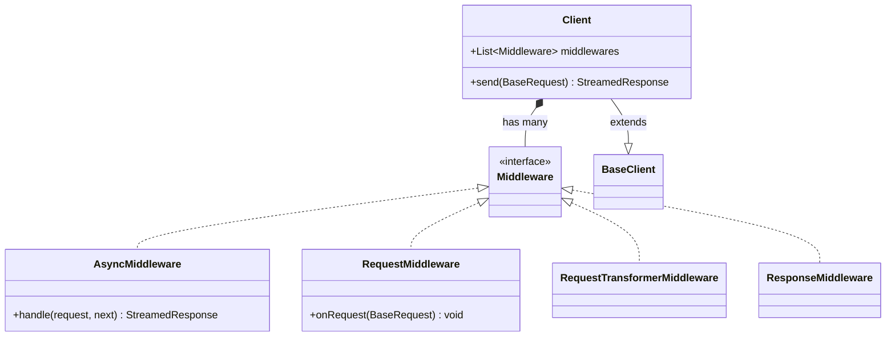
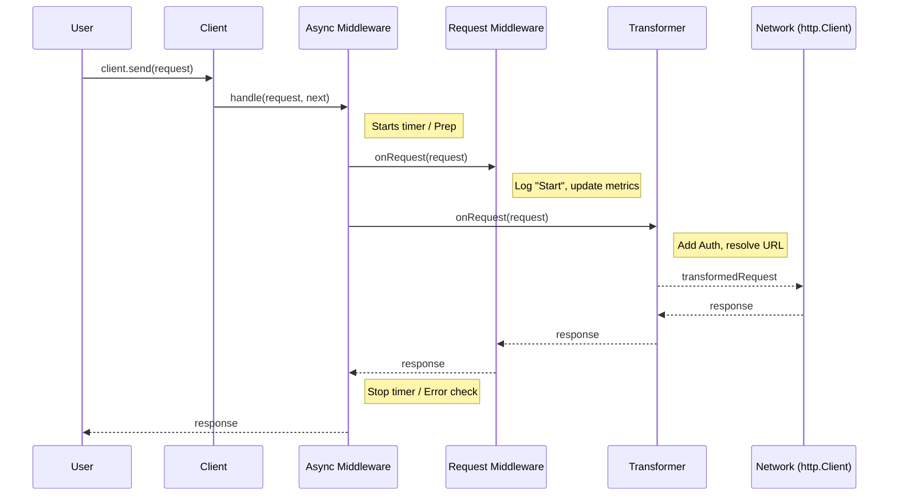

# http_toolkit

> 🔋 **The missing battery for Dart's `http` package.**

`http_toolkit` supercharges your HTTP requests with a composable **Middleware Pipeline**, **Type-Safe JSON utilities**, and robust **Retries**. It's designed to be a drop-in replacement for `http.Client` while solving the most common challenges in building robust Dart/Flutter network layers.

[](https://pub.dev/packages/http_toolkit)
[](https://opensource.org/licenses/MIT)

## 🌟 Features

- **🛡️ Type-Safe**: Eliminate unsafe casting with `getDecoded`, `postDecoded`, etc.
- **🔗 Composable**: Build complex behavior (Auth + Retry + Logging) using a simple list of middlewares.
- **⚡ Reliable**: Smart retries with exponential backoff to handle flaky networks.
- **🧩 Compatible**: implementing `http.BaseClient`, so it works with all your existing libraries.

---

## 🏗️ Architecture

The core of `http_toolkit` is the [Client], which wraps a standard `http.Client` and executes a pipeline of [Middleware].
This pipeline implements a layered "Onion Architecture", where requests traverse through layers of middleware
before reaching the network, and responses traverse back out.

Here some types of Middlewares that are available:

1.  **AsyncMiddleware**: Wraps the *entire* lifecycle (e.g., retries, timing).
2.  **RequestMiddleware**: synchronous inspection (e.g., analytics).
3.  **RequestTransformer**: modifies the request (e.g., injecting auth tokens).
4.  **Network**: The actual HTTP call.
5.  **ResponseMiddleware**: validates or transforms the response.

### Class Relationships



### Request & Response Flow

Use this diagram to understand how data flows through the system.



---

## 🛠️ Usage Guides

### 1. Installation

```yaml
dependencies:
  http_toolkit: ^3.0.0
```

### 2. Quick Start

Create a client and compose your middlewares:

```dart
import 'package:http_toolkit/http_toolkit.dart';

void main() async {
  final client = Client(
    middlewares: [
      // 1. Log network traffic
      LoggerMiddleware(logBody: true),
      
      // 2. Retry failed requests (e.g., timeout, 503)
      const RetryMiddleware(
        maxRetries: 3,
        strategy: BackoffStrategy.exponential(),
      ),
      
      // 3. Inject "Authorization: Bearer <token>"
      const BearerAuthMiddleware('your-secret-token'),
      
      // 4. Resolve paths against a base URL
      const BaseUrlMiddleware('https://api.example.com'),
    ],
  );

  // Use type-safe extensions!
  final user = await client.getDecoded<User, Map<String, dynamic>>(
    Uri.parse('/users/1'),
    mapper: User.fromJson,
  );
}
```

---

### 3. Safe JSON Requests 🛡️

Stop writing repetitive `jsonDecode` boilerplate and boilerplate `as Map` casts.

**Problem**:
```dart
// Traditional way
final response = await client.get(uri);
final json = jsonDecode(response.body) as Map<String, dynamic>;
final user = User.fromJson(json);
```

**Solution**:
```dart
// In http_toolkit 
final user = await client.getDecoded(
  uri,
  mapper: User.fromJson,
  // Optional: Add response validation before parsing
  responseValidator: ResponseValidator.success,
);
```

**Supported Methods**:
- `getDecoded<R, T>`
- `postDecoded<R, T>`
- `putDecoded<R, T>`
- `patchDecoded<R, T>`
- `deleteDecoded<R, T>`

#### Response Validation

Validate responses *before* parsing them.

```dart
await client.postDecoded(
  uri,
  body: payload,
  // Built-in validators:
  // - success: 200-299
  // - created: 201
  // - successOrNoContent: 200 or 204
  // - jsonContentType: ensures content-type is application/json
  responseValidator: (response) {
      ResponseValidator.created(response);
      ResponseValidator.jsonContentType(response);
  },
);
```

---

## 🧩 Middleware Deep Dive

### 🔄 Middleware Precedence

Understanding execution order is critical for composing behaviors correctly.

| Middleware Type | Order | Behavior | Best Use Case |
| :--- | :--- | :--- | :--- |
| **Async** | **LIFO** (Outer) | Wraps entire call | Retries, Error Handling, Response Timing |
| **Request** | **FIFO** (Inner) | Side-effect only | Logging, Metrics, Analytics |
| **Transformer** | **LIFO** (Inner) | Modifies request | Authentication, Base URL, Header injection |
| **Response** | **LIFO** (Inner) | Modifies response | Global Validation, Error mapping |

## 🧩 Built-in Middlewares

*   [RetryMiddleware]: Automatically retries failed requests with customizable backoff strategies.
*   [LoggerMiddleware]: Comprehensive logging of requests, responses, and errors.
*   [BearerAuthMiddleware] / [BasicAuthMiddleware]: Simple authentication injection.
*   [HeadersMiddleware]: Applies default headers to every request.
*   [BaseUrlMiddleware]: Resolves relative paths against a base URL.

### `RetryMiddleware`

**Why?**:

    Networks are flaky. Requests fail.  
    
**When?**:

    Always recommended for production apps. 

`http_toolkit` includes several retry strategies:

    - `FixedBackoffStrategy`: Time difference is fixed, If `delay` is 1s then each retry will wait exactly 1 seconds.
    - `LinearBackoffStrategy`: Time difference is linear, If `delay` is 1s then each retry will wait `delay` + `attempt` (1s, 2s, 3s, ...).
    - `ExponentialBackoffStrategy`: Time differencea grows exponentialy, If `delay` is 1s then each retry will double on the next `attempt` (1x, 2x, 4x, ...).

```dart
const RetryMiddleware(
  maxRetries: 3,
  strategy: BackoffStrategy.exponential(),
  
  // Optional: Only retry specific errors (e.g., 5xx errors)
  whenResponse: (response, attempt, duration) {
    return response.statusCode >= 500;
  },
  
  // Optional: Only retry specific exceptions (e.g., SocketException)
  whenError: (error, attempt, nextDelay) {
    return error is SocketException;
  },
);
```

### `LoggerMiddleware`

**Why?**:

    You need to see what's happening.  
    
**When?**:

    During development or for sending networks logs to some service in production.

**Caution**: Logging response `body` can be verbose and resource consuming since responses in `http` are streamed and
             these can only be consumed once. Hence try to avoid logging response bodies because it requires conversion from StreamedResponse -> Response -> StreamedResponse

```dart
LoggerMiddleware(
  logResponse: true,
  logRequest: true,
  logError: true,
  logStreamedResponseBody: false, // Avoid
  // Filter confidential headers
  headerFilter: (k, v) => k == 'Authorization' ? '***' : v,
  // Custom output (e.g., Crashlytics, File, Console)
  logger: (String message) => print('HTTP: $message'),
);
```

### `BaseUrlMiddleware`

**Why?**:

    Don't repeat the domain name in every request.  

**When?**:

    When your app communicates with a specific API service.

```dart
const BaseUrlMiddleware('https://api.myservice.com/v1');

// Now you can just use paths:
client.get(Uri.parse('/users')); 
```

### `BearerAuthMiddleware`

**Why?**:

    Automatically inject `Authorization: Bearer ...` headers.  

**When?**:

    When accessing protected resources.

```dart
const BearerAuthMiddleware('my-access-token');
```

---

## Contributing

Contributions are heavily encouraged! Discovered a bug? Have a feature request? Please feel free to submit a Pull Request or file an issue.

## License

This project is licensed under the MIT License - see the [LICENSE](https://github.com/maranix/http_toolkit/blob/main/LICENSE) file for details.
